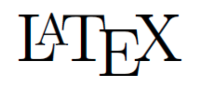



May need to refresh for the math  mode.

> Paper reading notes, and open-source contribution. 
  <ul>
    
  </ul>

> Reading notes, mathematical proofs, and Python implementations for ___Reinforcement Learning: An Introduction___ (and COMP 394 Reinforcement Learning at Macalester as TA).
  <ul>
    
  </ul>

