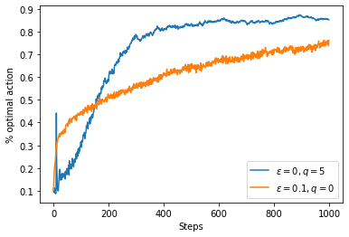
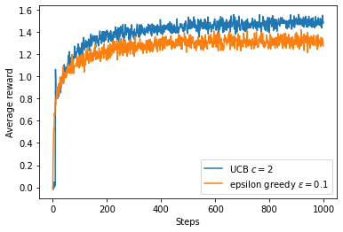
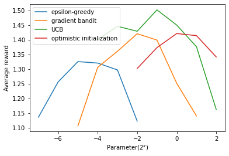

---
title: "Chapter 2 Multi-armed Bandits"
collection: rl
permalink: /rl/multi-armed-bandits
tags:
  - Reinforcement Learning
  - Tabular Solution Method
  - My Note
date: "2020-12-01"
--- 
***Reinforcement Learning: An Introduction***

> Author: Charles Zhang  <br>[*All Notes Catelog for* ***Reinforcement Learning: An Introduction***](https://zcczhang.github.io/blogs/). This post is created following [*BY-NC-ND 4.0*](https://creativecommons.org/licenses/by-nc-nd/4.0/deed.en) agreement, please follow terms while sharing. 

### Action-Value Methods

k-armed: k options(actions) 


Value: $q_{\*}(a) \doteq \mathbb{E}[R_t\mid A_t = a]$, using 
$Q_t(a) \approx q_{\*}(a)$ estimation.

$$
\begin{array}{l}
Q_{s}(a) \doteq \displaystyle\frac{\displaystyle\sum_{i=1}^{t-1} R_{i} \cdot \mathbb{1}_{A_{i}=a}}{\displaystyle\sum_{i=1}^{t-1} \mathbb{1}_{A_{i}=a}}, \mathbb{1}:=\left\{\begin{array}{l}
1 \text { if predicate is true } \\
0 \text { if predicate is false }
\end{array}\right.
\end{array}
$$

when $\displaystyle \sum_{i=1}^{t-1} \mathbb{1}_{A_i=a} \rightarrow \infty$ , $Q(a) \rightarrow q_{\*}(a)$


Greedy action: $A_{t} \doteq \arg \max_{a} Q_{t}(a), \epsilon$ -greedy: prevent local optimum


The estimate of its action value after it has been selected $n-1$ times:<br>

$$
\begin{aligned}
Q_{n} \doteq \frac{\sum_{i=1}^{n-1} R_{i}}{n-1} &=\frac{1}{n-1}\left(R_{n-1}+\sum_{i=1}^{n-2} R_{i}\right) \\
&=\frac{1}{n-1}\left(R_{n-1}+(n-2) \frac{1}{n-1} \sum_{i=1}^{n-2} R_{i}\right) \\
&=\frac{1}{n-1}\left(R_{n-1}+(n-2) Q_{n-1}\right) \\
&=\frac{1}{n-1}\left(R_{n-1}+(n-1) Q_{n-1}-Q_{n-1}\right) \\
&=Q_{n-1}+\frac{1}{n-1}\left(R_{n-1}-Q_{n-1}\right)
\end{aligned}
$$
<br>
or more general, $Q_{n+1}=Q_{n}+\frac{1}{n}\left(R_{n}-Q_{n}\right), n=1 \rightarrow Q_{2}=R_{1}$ for arbitrary.<br>

General <b>[Update Rule]</b>: NewEstimate $\leftarrow$ StepSize $\cdot$ [Target - OldEstimate], stepsize: $\alpha_t(a)$, Target - OldEstimate: "error" in estimate.
<br>
$$\begin{aligned}
Q_{n+1} &= \displaystyle Q_{n}+\alpha(R_{n}-Q_{n}) = \alpha R_n +(1-\alpha) Q_n \\
&= \alpha R_n +(1-\alpha)[\alpha R_{n-1} +(1-\alpha) Q_{n-1}] \\
&= \alpha R_n +(1-\alpha)\alpha R_{n-1} +(1-\alpha)^2\alpha R_{n-2} + ... +(1-\alpha)^n\alpha Q_1 \\
&= (1-\alpha)^n Q_1 + \sum_{i=1}^n \alpha(1-\alpha)^{n-i}R_i 
\end{aligned}$$


### Implementations


```python
import matplotlib
import matplotlib.pyplot as plt
import numpy as np
from tqdm import trange
%matplotlib inline
import warnings
warnings.filterwarnings('ignore')


class Bandit:

    def __init__(self, k_arm=10, epsilon=0., initial_val=0., step_size=0.1, sample_averages=False, UCB_param=None,
                 gradient=False, gradient_baseline=False, true_reward=0.):
        """
        :param k_arm: # of arms, 10 by default(same in the)
        :param epsilon: probability for exploration in epsilon-greedy algorithm
        :param initial_val: initial estimated value for each action
        :param step_size: constant step size(learning rate) for updating estimations
        :param sample_averages: if True, use sample averages to update estimations instead of constant step size
        :param UCB_param: if not None, use UCB algorithm to select action
        :param gradient: if True, use gradient based bandit algorithm
        :param gradient_baseline: if True, use average reward as baseline for gradient based bandit algorithm
        :param true_reward: the actual reward, q(A_t)
        """
        self.k = k_arm
        self.epsilon = epsilon
        self.initial_val = initial_val
        self.step_size = step_size
        self.sample_averages = sample_averages
        self.UCB_param = UCB_param
        self.gradient = gradient
        self.gradient_baseline = gradient_baseline
        self.true_reward = true_reward
        self.indices = np.arange(self.k)
        self.time = 0
        self.average_reward = 0
        self.action_prob = 0
        self.q_true = np.random.randn(self.k) + self.true_reward    # true(actual) value for each action, q(a)
        self.q_estimation = np.zeros(self.k) + self.initial_val     # estimated value for each action, Q(a)
        self.action_count = np.zeros(self.k)                        # # of chosen times for each action
        self.best_action = np.argmax(self.q_true)                   # best action based no Q table

    def reset(self):
        self.q_true = np.random.randn(self.k) + self.true_reward
        self.q_estimation = np.zeros(self.k) + self.initial_val
        self.action_count = np.zeros(self.k)
        self.best_action = np.argmax(self.q_true)
        self.time = 0

    def action(self):
        """
        :return: get an action for this bandit
        """
        if np.random.rand() < self.epsilon:
            return np.random.choice(self.indices)

        if self.UCB_param is not None:
            UCB_estimation = self.q_estimation + \
                             self.UCB_param * np.sqrt(np.log(self.time + 1) / (self.action_count + 1e-5))
            q_best = np.max(UCB_estimation)
            return np.random.choice(np.where(UCB_estimation == q_best)[0])

        if self.gradient:
            exp_est = np.exp(self.q_estimation)
            self.action_prob = exp_est / np.sum(exp_est)
            return np.random.choice(self.indices, p=self.action_prob)

        q_best = np.max(self.q_estimation)
        return np.random.choice(np.where(self.q_estimation == q_best)[0])

    # take an action, update estimation for this action
    def step(self, action):
        # generate the reward under N(real reward, 1)
        reward = np.random.randn() + self.q_true[action]
        self.time += 1
        self.action_count[action] += 1
        self.average_reward += (reward - self.average_reward) / self.time

        if self.sample_averages:
            # update estimation using sample averages
            self.q_estimation[action] += (reward - self.q_estimation[action]) / self.action_count[action]
        elif self.gradient:
            one_hot = np.zeros(self.k)
            one_hot[action] = 1
            if self.gradient_baseline:
                baseline = self.average_reward
            else:
                baseline = 0
            self.q_estimation += self.step_size * (reward - baseline) * (one_hot - self.action_prob)
        else:
            # update estimation with constant step size
            self.q_estimation[action] += self.step_size * (reward - self.q_estimation[action])
        return reward


def simulate(runs, time, bandits):
    rewards = np.zeros((len(bandits), runs, time))
    best_action_counts = np.zeros(rewards.shape)
    for i, bandit in enumerate(bandits):
        for r in trange(runs):
            bandit.reset()
            for t in range(time):
                action = bandit.action()
                reward = bandit.step(action)
                rewards[i, r, t] = reward
                if action == bandit.best_action:
                    best_action_counts[i, r, t] = 1
    mean_best_action_counts = best_action_counts.mean(axis=1)
    mean_rewards = rewards.mean(axis=1)
    return mean_best_action_counts, mean_rewards
```


```python
def figure_2_1(runs=1000, time=1000):
    epsilons = [0, 0.1, 0.01]
    bandits = [Bandit(epsilon=eps, sample_averages=True) for eps in epsilons]
    best_action_counts, rewards = simulate(runs, time, bandits)
    plt.figure(figsize=(6, 8))
    plt.subplot(2, 1, 1)
    for eps, rewards in zip(epsilons, rewards):
        plt.plot(rewards, label='$\epsilon = %.02f$' % (eps))
    plt.xlabel('steps')
    plt.ylabel('average reward')
    plt.legend()
    plt.subplot(2, 1, 2)
    for eps, counts in zip(epsilons, best_action_counts):
        plt.plot(counts, label='$\epsilon = %.02f$' % (eps))
    plt.xlabel('steps')
    plt.ylabel('% optimal action')
    plt.legend()
    plt.plot()

figure_2_1()
```

    100%|██████████| 1000/1000 [00:24<00:00, 40.05it/s]
    100%|██████████| 1000/1000 [00:24<00:00, 41.02it/s]
    100%|██████████| 1000/1000 [00:24<00:00, 40.12it/s]


Note $(1-\alpha)^n+ \displaystyle\sum_{i=1}^n \alpha(1-\alpha)^{n-i} = 1, \alpha \in [0,1]$, $Q_{n+1}$ therefore is called (exponetial recency-)weight average of past $R \text{ and } Q_1$.<br><br>
*Proof*:<br>
$n=1, 1-\alpha+\alpha = 1$;<br>
assume for $n=k, (1-\alpha)^k+ \displaystyle\sum_{i=1}^k \alpha(1-\alpha)^{k-i} = 1$;<br>
then for $n=k+1$, <br>
$$\begin{aligned} & (1-\alpha)^{k+1}+ \displaystyle\sum_{i=1}^{k+1} \alpha(1-\alpha)^{k+1-i} - [(1-\alpha)^k+ \displaystyle\sum_{i=1}^k \alpha(1-\alpha)^{k-i}] \\
&= (1-\alpha)^{k+1}- (1-\alpha)^{k} + \displaystyle\sum_{i=1}^k \alpha(1-\alpha)^{k-i} + \alpha(1-\alpha)^{k+1-1} - \displaystyle\sum_{i=1}^k \alpha(1-\alpha)^{k-i}\\
&= (1-\alpha)^k(1-\alpha-1)+\alpha(1-\alpha)^k \\
&= -\alpha(1-\alpha)^k+\alpha(1-\alpha)^k \\
&= 0
\end{aligned} 
$$

$\therefore  (1-\alpha)^{k+1}+ \displaystyle\sum_{i=1}^{k+1} \alpha(1-\alpha)^{k+1-i} = 1, \forall k \in \mathbb{N}$<br>
$\therefore \forall n\in\mathbb{N}, \text{ }\alpha \in [0,1], \text{ } (1-\alpha)^n+ \displaystyle\sum_{i=1}^n \alpha(1-\alpha)^{n-i} = 1$

Consider {$\alpha_n$} by stochastic approximation theory: P(coverage) = 1:
<br>

$$
\sum_{n=1}^\infty \alpha_n(a) = \infty \text{ }\text{ }\text{ }\text{ and } \text{ }\text{ }\text{ } \sum_{n=1}^\infty \alpha_n(a) < \infty 
$$

This means (i)steps are large enough to overcome initial condition or random fluctuations (ii) steps become small enough to coverage.
<br><br>
As $Q_{n+1}$ more or less dependent on $Q_1(a) \Rightarrow$ biased by initial estimate.<br>
Then, for genral stationary case, we encourage exploration optimistic initial value($Q_1>0, \epsilon=0$ compared with greedy's).


```python
def figure_2_2(runs=1000, time=1000):
    bandits = [Bandit(epsilon=0, initial_val=5, step_size=0.1), Bandit(epsilon=0.1, initial_val=0, step_size=0.1)]
    best_action_counts, _ = simulate(runs, time, bandits)

    plt.plot(best_action_counts[0], label='$\epsilon = 0, q = 5$')
    plt.plot(best_action_counts[1], label='$\epsilon = 0.1, q = 0$')
    plt.xlabel('Steps')
    plt.ylabel('% optimal action')
    plt.legend()
    plt.plot()

figure_2_2()
```

    100%|██████████| 1000/1000 [00:25<00:00, 39.52it/s]
    100%|██████████| 1000/1000 [00:23<00:00, 41.84it/s]





### Upper Confidence Bound(UCB)

Action selection:   
$$A_t \doteq \arg\max_a\left[Q_t(a)+c\cdot\sqrt{\frac{\ln t}{N_t(a)}}\right]$$
where $N_t(a)$: number of times "$a$" has been selected before "$t$";<br>
c>0 controls the degree of exploration;<br>
$\displaystyle \sqrt{\frac{\ln t}{N_t(a)}}$: uncertainty, or variance(many "action "$\rightarrow$bad$\rightarrow$less this "action")


```python
def figure_2_3(runs=1000, time=1000):
    bandits = [Bandit(epsilon=0, UCB_param=2, sample_averages=True), Bandit(epsilon=0.1, sample_averages=True)]
    _, average_rewards = simulate(runs, time, bandits)
    plt.plot(average_rewards[0], label='UCB $c = 2$')
    plt.plot(average_rewards[1], label='epsilon greedy $\epsilon = 0.1$')
    plt.xlabel('Steps')
    plt.ylabel('Average reward')
    plt.legend()
    plt.plot()
    
figure_2_3()
```

    100%|██████████| 1000/1000 [00:32<00:00, 30.80it/s]
    100%|██████████| 1000/1000 [00:24<00:00, 40.56it/s]





### Gradient Bandits Algorithm

soft-max distribution(i.e. Gibbs or Boltzmann distribution)<br>
$$\text{Pr}\{A_t=a\} \doteq \displaystyle \frac{e^{H_t(a)}}{\sum_{b=1}^k e^{H_t(b)}} \doteq \pi_t(a)$$

$H_t(a)\in\mathbb{R}$: preference for each action, initially $H_1(a)=0$
Natural Learning algorithmm for soft-max action preferences based on the idea of the stochastic gradient ascent(↑). For update: 

$$
H_{t+1}(A_t) \doteq H_t(A_t) + \alpha(R_t-\overline{R_t})(\mathbb{1}_{a=A_t}-\pi_t(A_t))
$$

$$
H_{t+1}(a) \doteq H_t(a) + \alpha(R_t-\overline{R_t})\pi_t(a)
$$

where $\alpha>0, \overline{R_t} = avr\{ R_1...R_{t-1} \}$<br>
$\overline{R_t}\Rightarrow$ baseline, $R_t>\overline{R_t}, P(A_t)$ in the future increases, vice versa.
<br>
Conclusion: it is a stochastic approximation to gradient ascent:

$$
H_{t+1}(a)\doteq H_t(a)+\alpha\frac{\partial \mathbb{E}[R_t]}{\partial H_t(a)},\text{ }\text{ }\text{ }\text{ }  \mathbb{E}[R_t] = \sum_x\pi_t(x) q_{\*}(x)
$$

update = gradient of $\mathbb{E}[R_t]\Rightarrow$ stochastic gradient ascent $\Rightarrow$ robust convergence.

*Proof:*

$\begin{aligned} \frac{\partial \mathbb{E}\left[R_{t}\right]}{\partial H_{t}(a)} &=\frac{\partial}{\partial H_{t}(a)}\left[\sum_{b} \pi_{t}(b) q_{\*}(b)\right] \\ &=\sum_{b} q_{\*}(b) \frac{\partial \pi_{t}(b)}{\partial H_{t}(a)} \end{aligned}$
<br>
Let $\forall X_t$ and $b$ are independent, then $\displaystyle \sum_b\frac{\partial\pi_t(b)}{\partial H_t(b)} = 0$, so we have
<br>
$\begin{aligned}\frac{\partial \mathbb{E}\left[R_{t}\right]}{\partial H_{t}(a)} &
=\sum_{b}\left(q_{\*}(b)-X_{t}\right) \frac{\partial \pi_{t}(b)}{\partial H_{t}(a)} \\
&=\sum_{b} \pi_{t}(b)\left(q_{\*}(b)-X_{t}\right) \frac{\partial \pi_{t}(b)}{\partial H_{t}(a)} / \pi_{t}(b) \\
&=\mathbb{E}\left[\left(q_{\*}\left(A_{t}\right)-X_{t}\right) \frac{\partial \pi_{t}\left(A_{t}\right)}{\partial H_{t}(a)} / \pi_{t}\left(A_{t}\right)\right]
\end{aligned}$
<br><br>
given $A_t, \mathbb{E}[R_t|A_t] = q_{\*}(A_t) = R_t$, and let arbitary $X_t$ be $\overline{R_t}$ then:
<br><br>
$\displaystyle
\frac{\partial \mathbb{E}\left[R_{t}\right]}{\partial H_{t}(a)} = \mathbb{E}\left[\left(R_t)-\overline{R_t}\right) \frac{\partial \pi_{t}\left(A_{t}\right)}{\partial H_{t}(a)} / \pi_{t}\left(A_{t}\right)\right]
$
<br><br>
Next,
<br><br>
$\begin{aligned}
\frac{\partial \pi_{t}(b)}{\partial H_{t}(a)} &=\frac{\partial}{\partial H_{t}(a)} \pi_{t}(b) \\
&=\frac{\partial}{\partial H_{t}(a)}\left[\frac{e^{H_{t}(b)}}{\sum_{c=1}^{k} e^{H_{t}(c)}}\right] \\
&=\frac{\frac{\partial e^{H_{t}(b)}}{\partial H_{t}(a)} \sum_{c=1}^{k} e^{H_{t}(c)}-e^{H_{t}(b)} \frac{\partial \sum_{c=1}^{k} e^{H_{t}(c)}}{\partial H_{t}(a)}}{\left(\sum_{c=1}^{k} e^{H_{t}(c)}\right)^{2}} \\
&=\frac{\mathbb{1}_{a=b} e^{H_{t}(a)} \sum_{c=1}^{k} e_{t}^{H}(c)-e^{H_{t}(b)} e^{H_{t}(a)}}{\left(\sum_{c=1}^{k} e^{H_{t}(c)}\right)^{2}} \\
&=\frac{\mathbb{1}_{a=b} e^{H_{t}(b)}}{\sum_{c=1}^{k} e^{H_{t}(c)}}-\frac{e^{H_{t}(b)} e^{H_{t}(a)}}{\left(\sum_{c=1}^{k} e^{H_{t}(c)}\right)^{2}} \\
&=\mathbb{1}_{a=b} \pi_{t}(b)-\pi_{t}(b){\pi}_{t}(a) \\
&=\pi_{t}(b)\left(\mathbb{1}_{a=b}-\pi_{t}(a)\right)
\end{aligned}$
<br><br>
Therefore,
<br><br>
$
\begin{aligned}
\frac{\partial \mathbb{E}\left[R_{t}\right]}{\partial H_{t}(a)} &=\mathbb{E}\left[\left(R_{t}-\overline{R}_{t}\right) \frac{\partial \pi_{t}\left(A_{t}\right)}{\partial H_{t}(a)} / \pi_{t}\left(A_{t}\right)\right] \\
&=\mathbb{E}\left[\left(R_{t}-\overline{R}_{t}\right) \pi_{t}\left(A_{t}\right)\left(\mathbf{1}_{a=A_{t}}-\pi_{t}(a)\right) / \pi_{t}\left(A_{t}\right)\right] \\
&=\mathbb{E}\left[\left(R_{t}-\overline{R}_{t}\right)\left(\mathbf{1}_{a=A_{t}}-\pi_{t}(a)\right)\right]
\end{aligned}
$
<br><br>
which is corresponding with the equation for the gradient ascent. 


```python
def figure_2_4(runs=1000, time=1000):
    bandits = [Bandit(gradient=True, step_size=0.1, gradient_baseline=True, true_reward=4),
               Bandit(gradient=True, step_size=0.1, gradient_baseline=False, true_reward=4),
               Bandit(gradient=True, step_size=0.4, gradient_baseline=True, true_reward=4),
               Bandit(gradient=True, step_size=0.4, gradient_baseline=False, true_reward=4)]
    best_action_counts, _ = simulate(runs, time, bandits)
    labels = [r'$\alpha = 0.1$, with baseline',
              r'$\alpha = 0.1$, without baseline',
              r'$\alpha = 0.4$, with baseline',
              r'$\alpha = 0.4$, without baseline']

    for i in range(len(bandits)):
        plt.plot(best_action_counts[i], label=labels[i])
    plt.xlabel('Steps')
    plt.ylabel('% Optimal action')
    plt.legend()
    plt.plot()

figure_2_4()
```

    100%|██████████| 1000/1000 [00:41<00:00, 23.86it/s]
    100%|██████████| 1000/1000 [00:41<00:00, 23.88it/s]
    100%|██████████| 1000/1000 [00:40<00:00, 24.86it/s]
    100%|██████████| 1000/1000 [00:40<00:00, 24.90it/s]


### Summary

A parameter study of the various bandit algorithms presented in
this chapter is shown below. Each point is the average reward obtained over 1000 steps with
a particular algorithm at a particular setting of its parameter.


```python
def figure_2_5(runs=1000, time=1000):
    labels = ['epsilon-greedy', 'gradient bandit',
              'UCB', 'optimistic initialization']
    generators = [lambda epsilon: Bandit(epsilon=epsilon, sample_averages=True),
                  lambda alpha: Bandit(gradient=True, step_size=alpha, gradient_baseline=True),
                  lambda coef: Bandit(epsilon=0, UCB_param=coef, sample_averages=True),
                  lambda initial: Bandit(epsilon=0, initial_val=initial, step_size=0.1)]
    parameters = [np.arange(-7, -1, dtype=np.float),
                  np.arange(-5, 2, dtype=np.float),
                  np.arange(-4, 3, dtype=np.float),
                  np.arange(-2, 3, dtype=np.float)]

    bandits = []
    for generator, parameter in zip(generators, parameters):
        for param in parameter:
            bandits.append(generator(pow(2, param)))

    _, average_rewards = simulate(runs, time, bandits)
    rewards = np.mean(average_rewards, axis=1)

    i = 0
    for label, parameter in zip(labels, parameters):
        l = len(parameter)
        plt.plot(parameter, rewards[i:i + l], label=label)
        i += l
    plt.xlabel('Parameter($2^x$)')
    plt.ylabel('Average reward')
    plt.legend()
    plt.plot()

figure_2_5()
```

    100%|██████████| 1000/1000 [00:25<00:00, 39.19it/s]
    100%|██████████| 1000/1000 [00:25<00:00, 39.90it/s]
    100%|██████████| 1000/1000 [00:26<00:00, 37.17it/s]
    100%|██████████| 1000/1000 [00:29<00:00, 34.25it/s]
    100%|██████████| 1000/1000 [00:30<00:00, 33.00it/s]
    100%|██████████| 1000/1000 [00:24<00:00, 41.64it/s]
    100%|██████████| 1000/1000 [00:42<00:00, 23.74it/s]
    100%|██████████| 1000/1000 [00:40<00:00, 24.46it/s]
    100%|██████████| 1000/1000 [00:41<00:00, 23.94it/s]
    100%|██████████| 1000/1000 [00:43<00:00, 23.04it/s]
    100%|██████████| 1000/1000 [00:43<00:00, 22.83it/s]
    100%|██████████| 1000/1000 [00:41<00:00, 24.31it/s]
    100%|██████████| 1000/1000 [00:43<00:00, 23.18it/s]
    100%|██████████| 1000/1000 [00:32<00:00, 31.07it/s]
    100%|██████████| 1000/1000 [00:36<00:00, 27.69it/s]
    100%|██████████| 1000/1000 [00:35<00:00, 28.10it/s]
    100%|██████████| 1000/1000 [00:33<00:00, 30.23it/s]
    100%|██████████| 1000/1000 [00:32<00:00, 30.88it/s]
    100%|██████████| 1000/1000 [00:33<00:00, 29.97it/s]
    100%|██████████| 1000/1000 [00:38<00:00, 25.89it/s]
    100%|██████████| 1000/1000 [00:34<00:00, 28.63it/s]
    100%|██████████| 1000/1000 [00:34<00:00, 29.35it/s]
    100%|██████████| 1000/1000 [00:30<00:00, 32.29it/s]
    100%|██████████| 1000/1000 [00:31<00:00, 31.55it/s]
    100%|██████████| 1000/1000 [00:31<00:00, 31.71it/s]





***Reference***

[1] Sutton, Richard S., and Andrew G. Barto. Reinforcement learning: An introduction. MIT press, 2018.

[2] https://github.com/ShangtongZhang/reinforcement-learning-an-introduction
